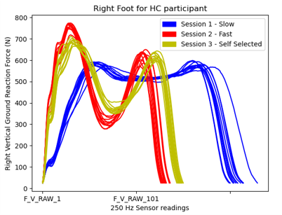
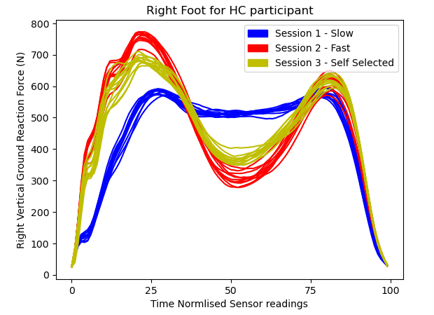
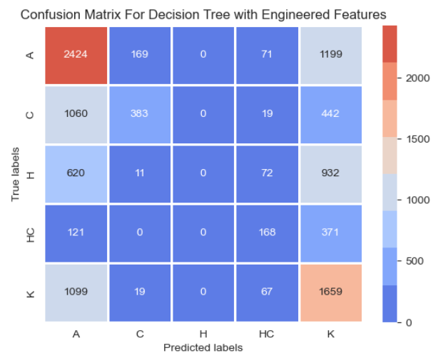
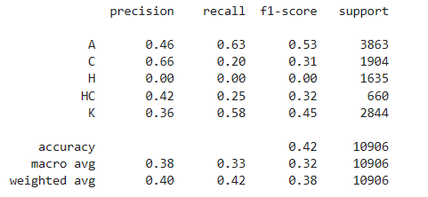
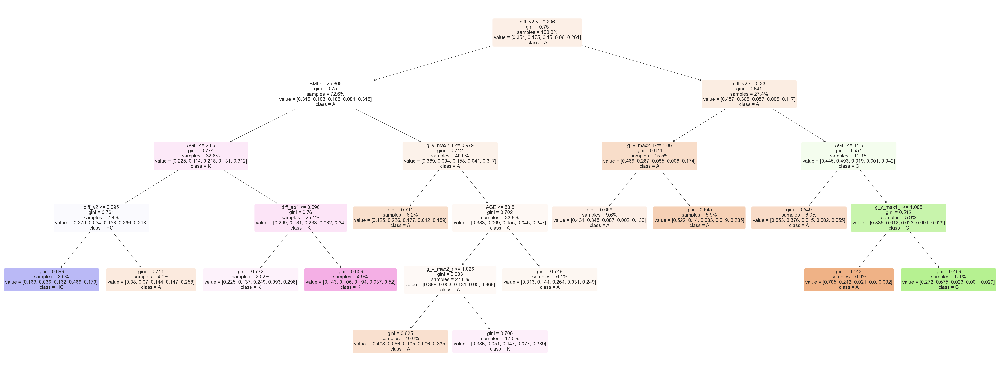
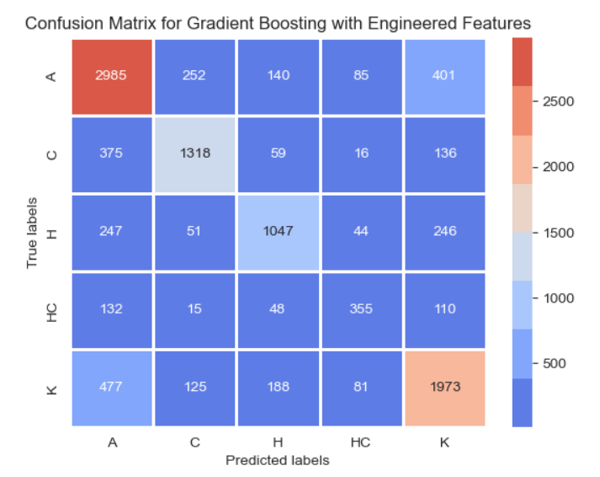
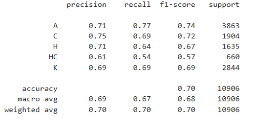
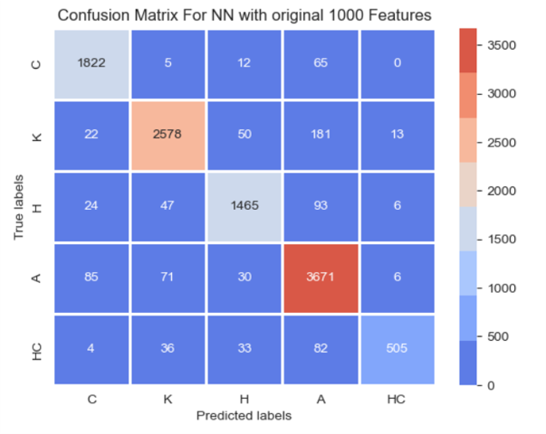
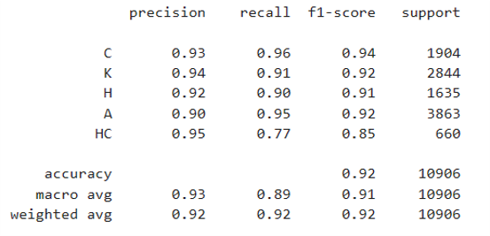
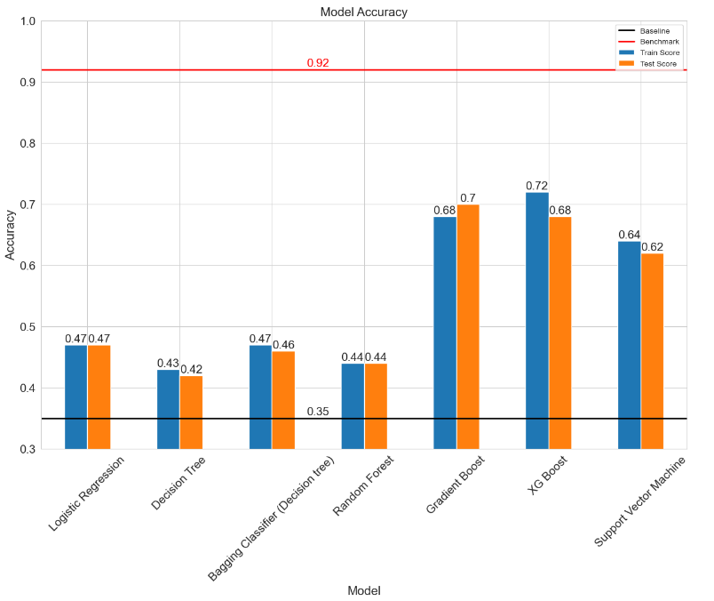

# GA DSI Capstone: Walking Gait Analysis via Machine Learning

# Table of contents
1. [Project Description](#1-project-description)  
    1.1. [Problem Statement](#11-problem-statement)  
    1.2. [Background](#12-background)  
    1.3. [Data](#13-data)   
    1.4. [Overview](#14-overview)   
2. [Results and learnings](#2-results-and-learnings)  
    2.1. [Training and evaluation results](#21-training-and-evaluation-results)  
    2.2. [Model Selection and Conclusion](#22-model-selection-and-conclusion)  
3. [References](#3-references)  
 

# 1. Project Description
[[back to the top]](#table-of-contents)  

## 1.1. Problem Statement ##
[[back to the top]](#table-of-contents)  
Using machine learning model on walking data from GaitRec database, this project aims to infer key features that relates with different walking issues. As an extension to domain knowledge, we can use additional features indentified in this project to help suggest affordable wearable sensors that target these key features that can help clinicians monitor the outcomes of treatment.  

## 1.2. Background ##
[[back to the top]](#table-of-contents)  

In addition to Singapore’s ageing population, there are many factors affecting walking gait, balance, mobility and quality of life.  

Common issues affecting walking are:  
* Osteoarthritis
* Parkinson's disease
* Stroke
* Muscular atropy
* Hip fractures 
* Musculoskeletal injuries
* Loss of balance

 

Among 150,000 household surveyed in 2020 population census, 62,500 people faced mobility challenges such as walking and climbing steps. (https://www.straitstimes.com/singapore/100000-singapore-residents-face-difficulties-performing-basic-activities-population-census)

 

## 1.3. Data ##    
[[back to the top]](#table-of-contents)  

Data source is a publicly available online database for gait research: [1]
* https://springernature.figshare.com/collections/GaitRec_A_large-scale_ground_reaction_force_dataset_of_healthy_and_impaired_gait/4788012 

 
    
GAITREC is a large dataset containing bi-lateral GRF walking trials of over 2000 patients with labelled gait disorders, as well as over 200 healthy controls.
It includes joint replacement, fractures, ligament ruptures, and related disorders at the hip, knee, ankle or calcaneus during entire stay in rehabilitation center. [1]

 

**Each of the 2000+ participants is labelled by experts:**  
 
|Classification| Abbrevation|
|--|--|
|Healthy Controls| HC|
|Gait Disorders|GD|
|Gait Disorders - Knee|K|
|Gait Disorders - Hip|H|
|Gait Disorders - Ankle|A|
|Gait Disorders - Calcaneus|C|

**Data Dictionary** 
|Dataset| Description| Data shape| Data type|
|--|--|--|--|
|Vertical GRF|Vertical Ground Reaction Force taken for participant during a session|1xn|double|
|Anterior-Posterior GRF| Breaking and propulsive shear force taken for participant during a session|1xn|double|
|Medio-lateral GRF| Side-to-side shear force taken for participant during a session|1xn|double|
|Anterior-Posterior COP| Center of Pressure coordinate in walking direction taken for participant during a session|1xn|double|
|Medio-lateral COP| Center of Pressure coordinate in side-to-side direction taken for participant during a session|1xn|double|
|Labels|Gait labelling for each of the participant done by experts |NA|NA|

Notes: 
* GRF: Ground reaction force in newtons (N)
* COP: Center of Pressure coordinate (cm)

**Features Selection Pool** 
|Feature| Description| Data shape| Data type|
|--|--|--|--|
|SUBJECT_ID|Participant Identifier|1|int64|
|SESSION_ID|Session Identifier|1|int64|
|TRIAL_ID|Trial number|1|int64|
|c_ml_min_r|Right rotational minimum Center of Pressure|1|float64|
|c_ml_max_r|Right rotational maximum Center of Pressure|1|float64|
|c_ml_min_l|Left rotational maximum Center of Pressure|1|float64|
|c_ml_max_l|Left rotational minimum Center of Pressure|1|float64|
|c_ap_slope_r|Right horizontal change in Center of Pressure|1|float64|
|c_ap_slope_l|Left horizontal change in Center of Pressure|1|float64|
|g_ml_max1_r|Right rotational landing in Ground reaction force|1|float64|
|g_ml_min_r|Right rotational transfer Ground reaction force|1|float64|
|g_ml_max2_r|Right rotational push-off Ground reaction force|1|float64|
|g_ml_max1_l|Left rotational landing in Ground reaction force|1|float64|
|g_ml_min_l|Left rotational transfer Ground reaction force|1|float64|
|g_ml_max2_l|Left rotational push-off Ground reaction force|1|float64|
|g_ap_min_r|Right horizontal landing Ground reaction force|1|float64|
|g_ap_max_r|Right horizontal push-off Ground reaction force|1|float64|
|g_ap_min_l|Left horizontal landing Ground reaction force|1|float64|
|g_ap_max_l|Left horizontal push-off Ground reaction force|1|float64|
|g_v_max1_r|Right vertical landing Ground reaction force|1|float64|
|g_v_min_r|Right vertical transfer Ground reaction force|1|float64|
|g_v_max2_r|Right vertical push-off Ground reaction force|1|float64|
|g_v_max1_l|Left vertical landing Ground reaction force|1|float64|
|g_v_min_l|Left vertical transfer Ground reaction force|1|float64|
|g_v_max2_l|Left vertical push-off Ground reaction force|1|float64|
|diff_v1|Difference between left and right leg's vertical Ground reaction force during landing|1|float64|
|diff_v2|Difference between left and right leg's vertical Ground reaction force during push-off|1|float64|
|diff_ap1|Difference between left and right leg's horizontal Ground reaction force during landing|1|float64|
|diff_ap2|Difference between left and right leg's horizontal Ground reaction force during push-off|1|float64|
|AGE|Age of participant|1|int64|
|BMI|Body-mass-index of participant|1|float64|
|CLASS_LABEL|Expert labelled classification of walking gait of participant|1|string|

 

**Processing of Data**
* The data are time normalised to 100% of a stride
* The data is resampled from 90-400 readings to 100 readings
* Force readings are normalised by participant's weight

1. Before Processing

2. After Processing

## 1.4. Overview ##    
[[back to the top]](#table-of-contents)

1. [Data Processing](./code/1_Data_Processing.ipynb)
> * Data preparation, description and cleaning
> * Normalise each trial reading to 100% of the stride, 100 data points.
> * Normalise GRF with Body weight
2. [EDA and Feature Engineering](./code/2_EDA.ipynb)
> * Visualise healthy and unhealthy walking gait
> * Create features from the normalised readings to differentiate the walking gait
> * Merge dataset
3. [Features Selection](./code/3_Feature_Selection.ipynb)
4. [Model Training and Evaluation](./code/4_Model.ipynb)
5. [Benchmarking with Neural Network](./code/5_Model_NeuralNetwork.ipynb)

**Success Metric**
1. Interpretable Gait Classification model with good accuracy/recall
2. List of key features as markers for each of the gait disorders

 

# 2. Results and learnings
[[back to the top]](#table-of-contents)  

## 2.1. Training and evaluation results ##
[[back to the top]](#table-of-contents)  

**Decision Tree Built using 12 selected features**
* Interpretable model with **42%** accuracy

 
* View of the pruned Decision Tree:

**Gadient Boosted Tree Built using 12 selected features**
* Alternative Model with **70%** accuracy

**Neural Network Built Using 1000 features as Benchmark**
* Benchmark model with **92%** accuracy

## 2.2. Model Selection and Conclusion ##
[[back to the top]](#table-of-contents)  

**Summary of model scores:**

Comparsion of all the models trained wrt baseline and benchmark:  

**Conclusion:**
1. Using key features like BMI, Age, maximum landing force, push force, together with differences in vertical and horizontal forces between left and right leg can approximately reach 70% accuracy in classification of gait, which is a good alternative to the neural network of 92% trained with 1000 features derived from sophisticated force plate only available in a dedicated lab.
2. There is feasibility in exploring more key features and affordable sensors that target these key features in solutions and research available currently.

 

**Future Exploration:**  
* Work in progress

## 3. References ##
[[back to the top]](#table-of-contents)  
[1] Horsak, B., Slijepcevic, D., Raberger, AM. et al. GaitRec, a large-scale ground reaction force dataset of healthy and impaired gait. Sci Data 7, 143 (2020)
 https://www.nature.com/articles/s41597-020-0481-z

 

